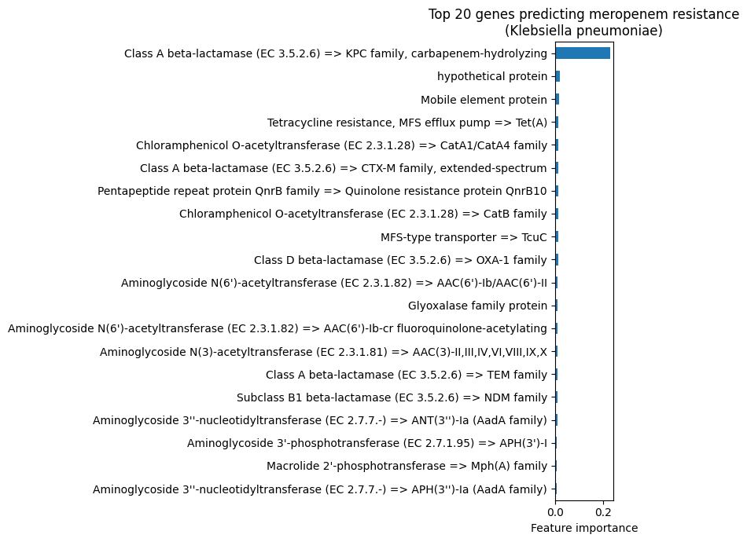

# Predicting Antibiotic Resistance in *Klebsiella pneumoniae* from Genome Content

A machine learning pipeline that predicts whether a *Klebsiella pneumoniae* genome is resistant or susceptible to **meropenem** (a carbapenem antibiotic), using the presence and absence of resistance-associated genes as features.

> **Headline result:** A random forest trained on ~4,300 lab-tested genomes achieves **ROC-AUC ≈ 0.74**. Feature-importance analysis shows the model relies most heavily on the **KPC carbapenemase gene**, recovering the single most important known driver of carbapenem resistance in *Klebsiella*, with NDM and OXA carbapenemases as secondary predictors.

---

## Data

All data comes from [**BV-BRC**](https://www.bv-brc.org/) (the Bacterial and Viral Bioinformatics Resource Center).

- **Labels (phenotypes):** Meropenem resistance phenotypes for *K. pneumoniae*, filtered to laboratory-measured results only (excluding computationally predicted labels, to avoid training on another model's guesses). After cleaning, dropping Intermediate/undefined phenotypes and genomes with conflicting lab results, this gives **~4,300 genomes** (≈2,660 susceptible, ≈1,610 resistant).
- **Features (genes):** Resistance-associated genes per genome, pulled from BV-BRC's specialty-gene data via its REST API, then filtered to the "Antibiotic Resistance" category. Each gene becomes a binary feature: 1 if the genome carries it, 0 if not. This yields ~490 gene features.

Data was retrieved programmatically rather than by manual download, so the pipeline is reproducible (see the notebook for the exact API queries).

## Method

1. **Build a feature matrix** — pivot the gene data into a genome × gene table of 1s and 0s (presence/absence). Genomes with no detected resistance genes become all-zero rows, which is itself meaningful signal.
2. **Join to labels** — each genome's feature row is paired with its lab-verified phenotype.
3. **Train/test split** — 75/25, stratified to preserve class balance.
4. **Random forest classifier** (scikit-learn, 300 trees). Two versions are compared: one with default class weighting and one with balanced weighting, to illustrate the precision/recall tradeoff.
5. **Interpret** — extract feature importances to see which genes the model relies on.

## Results

The choice of class weighting produces two models that make opposite kinds of errors:

| Model | Accuracy | ROC-AUC | Resistant precision | Resistant recall |
|---|:---:|:---:|:---:|:---:|
| Default weighting | 0.70 | **0.744** | 0.89 | 0.22 |
| Balanced weighting | 0.59 | 0.713 | 0.48 | 0.91 |

- The **default** model is conservative: when it predicts "resistant," it is right ~89% of the time (very few false alarms), but it misses many resistant genomes.
- The **balanced** model catches 91% of resistant genomes, but with many false positives.

Neither is better; they are tuned to different costs. In a clinical context, missing a resistant infection (a false negative) is more dangerous than a false alarm, which makes the high-recall balanced model arguably the safer choice despite lower headline accuracy.

### What the model learned

The feature-importance analysis is the most informative result. The **KPC carbapenemase dominates** (importance ≈ 0.23, more than 10× the next feature). KPC is the most prevalent carbapenemase in *Klebsiella* worldwide, so the model recovered the correct biology directly from the data.

Secondary predictors include **NDM** and **OXA** carbapenemases and a **mobile-element protein** — biologically coherent, since carbapenemase genes spread on mobile genetic elements and co-resistance genes travel together on the same plasmids.

## Discussion and limitations

The model works, but its behavior reveals an important biological truth: **acquired carbapenemase genes are highly specific markers of resistance but explain only part of it.** Roughly three-quarters of the resistant genomes in this dataset do *not* carry one of the specific carbapenemase genes (KPC/NDM/OXA-48). Their resistance arises from mechanisms that gene-presence features cannot see, such as:

- **Porin loss** (mutations in OmpK35/OmpK36 that reduce drug entry)
- **Efflux pump upregulation**
- **ESBLs combined with reduced membrane permeability**

This is why the default model has high precision but limited recall: carbapenemase presence almost guarantees resistance, but its absence does not guarantee susceptibility. **The model's performance ceiling is set by the features, not the algorithm.**

**Other limitations:**

- Presence/absence ignores gene variants — some mutations change function without changing presence.
- The dataset reflects whatever has been sequenced and reported, which may not represent global resistance patterns evenly.

## Future work

- **Add mutation (SNP) features** for porin and efflux genes to capture non-acquired resistance — the natural next step to lift recall.
- **Extend to other antibiotics** to test whether the pipeline generalizes (it should work especially well for drug classes dominated by acquired genes).
- **Compare classifiers** (gradient boosting, logistic regression) and add cross-validation for more robust performance estimates.

## Reproducing this

1. Open the notebook in Google Colab.
2. Download the meropenem labels CSV from BV-BRC (*K. pneumoniae* → AMR Phenotypes → filter to meropenem + Laboratory Method evidence → Download CSV).
3. Run the cells in order (1, 2, 4, 5, 5d, 6, 6b, 7). The gene features are pulled automatically from the BV-BRC API; no large manual download is required.

**Stack:** Python, pandas, scikit-learn, requests, matplotlib (see `requirements.txt`).

## Notes

This was built as a learning project. The development process involved a fair amount of real debugging, including diagnosing why certain API filter combinations silently returned no data (resolved by filtering client-side instead), and discovering that an initial target (TB streptomycin resistance) was mutation-driven rather than gene-driven, which motivated the switch to a gene-mediated resistance system. Those bugs and errors are part of the work and are documented in the notebook.
